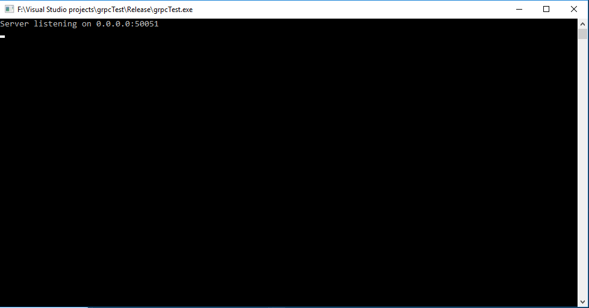

# GRPC test

This repo is just a boilerplate to get people started with GRPC, protobufs in C++ on Visual Studio. It provides all the necessary files to get you started in both debug and release scenario's. I've made this project because I personally had a hard time getting GRPC to work and I saw others were having the same issue.

## Proof
Know that the whole point of this project is not what the actual code is and what it does. But just a simple example that it even compiles. To get GRPC to work you need both protobuf, grpc(gpr.lib, grpc.lib, grpc++.lib) and some third party dependencies such as: zlib.lib, boringSSL(crypto.lib, decrepit.lib, ssl.lib).

All of the necessary files are located in dependencies/raw.7z

Here is a screenshot of it working!

## Versions

- [Protobuf](https://github.com/google/protobuf/releases): 3.5
- [GRPC](https://github.com/grpc/grpc/releases) 1.7.3

## Example used

The example used in this project is the [Helloworld make](https://github.com/grpc/grpc/tree/master/examples/cpp/helloworld) project. It just has been copied over, adjusted slightly and made work in Visual Studio 2017.

## Contribute

I won't be able to keep maintaining this project with each new version of either GRPC or protobuf. As of the time of writing this, everything is on the latest stable version. Please consider forking this project and updating the libraries if a new version comes along. I'm accept pull requests.